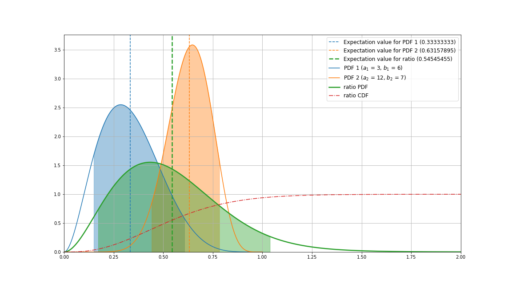
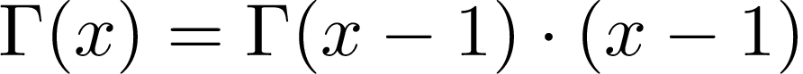

# Beta Quotient Distribution

*One example of a beta quotient distribution determined by this script. Blue and orange lines show two independent beta distributions with parameters a=3, b=6 and a=12, b=7, respectively. Their expectation values are marked with vertival dashed lines. The green curve represents the PDF of the ratio of both random variables, whereas the red dash-dotted line is the respective CDF. The shaded regions are 90% credible intervals.*

## The Probability Density

According to [1] the probability density function (PDF) of the ratio of two random variables

which each follow the PDFs of beta distributions

and

respectively where the Beta function B(_y_,_z_) is

is given by

for 0 < w < 1 and

for w > 1.

The hypergeometric fuctions 2F1 take the form [2]

for w<1 and

for w>1.

## The Cumulative Distribution

Using the fact that

and

one can calculate the integral of the PDF, the cumulative density function (CDF):

for w<1 and 

for w>1.

## Expectation Values

For the expectation value of a fraction _x_/_y_, where _x_ and _y_ follow beta distributions as above, one generally has:

with

and

where one uses the representation of the beta function with gamma functions as stated above together with their property

Hence, as result one obtains

---

[1] _Pham-Gia, T. "Distributions of the ratios of independent beta variables and applications." Communications in Statistics-Theory and Methods 29.12 (2000): 2693-2715._

[2] _Luke, Yudell L., ed. Special functions and their approximations. Vol. 2. Academic press, 1969._
