# Beta quotient distribution

According to [1] the probability density function (PDF) of the ratio of two random variables

which each follow the PDFs of beta distributions

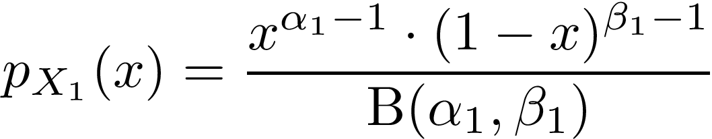

and

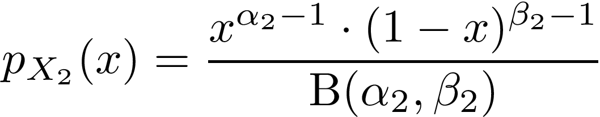

respectively where the Beta function B(a,b) is

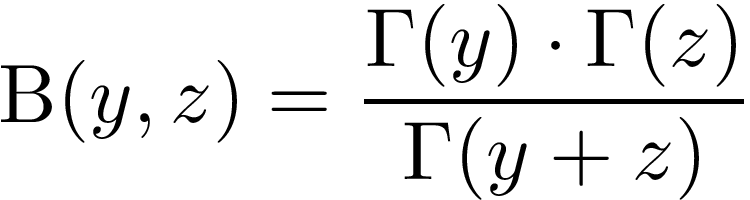,

is given by

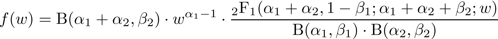

for 0 < w < 1 and

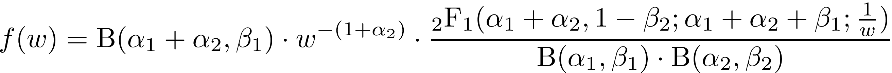

for w > 1.

The hypergeometric fuctions 2F1 take the form [2]

for w<1 and

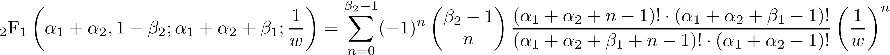

for w>1.

Using the fact that

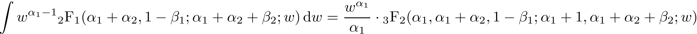

and

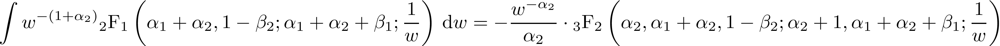

one can calculate the integral of the PDF, the cumulative density function (CDF):

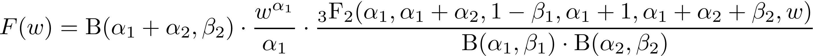

for w<1 and 

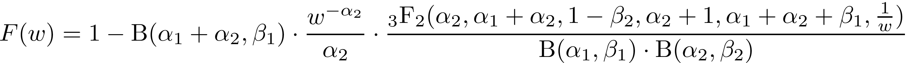

for w>1.

For the expectation value of a fraction x/y one has:

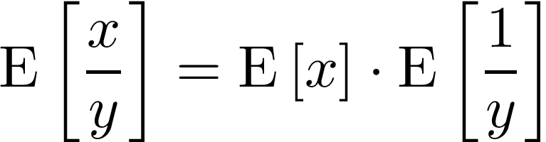

with

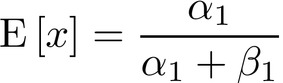

and

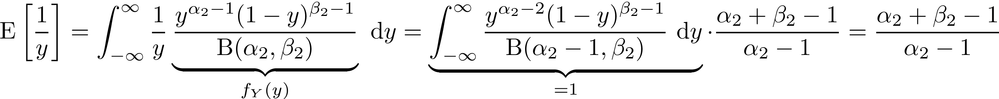

Hence, as result on obtains

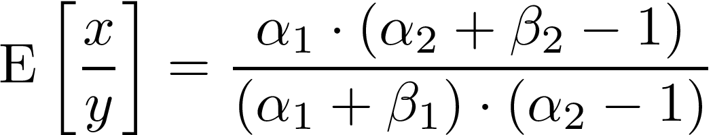

[1] _Pham-Gia, T. "Distributions of the ratios of independent beta variables and applications." Communications in Statistics-Theory and Methods 29.12 (2000): 2693-2715._

[2] _Luke, Yudell L., ed. Special functions and their approximations. Vol. 2. Academic press, 1969._

---