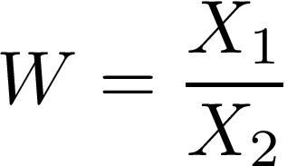
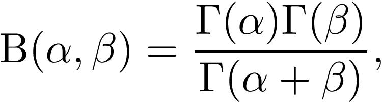

# Beta quotient distribution

According to _[Pham-Gia, 2000]_ the probability density function (PDF) of the ratio of two random variables

which each follow the PDFs of beta distributions

and

respectively where the Beta function B(a,b) is

is given by

for 0 < w < 1 and

for w > 1.

The hypergeometric fuctions 2F1 take the form (see page 40, Yudell L. Luke, 1969)

${}_2F_1(\alpha_1 + \alpha_2, 1-\beta_1; \alpha_1 + \alpha_2 + \beta_2; w) = \sum_{n=0}^{\beta_1-1}(-1)^n \begin{pmatrix} \beta_1-1 \\ n\end{pmatrix} \frac{(\alpha_1+\alpha_2+n-1)!\cdot(\alpha_1+\alpha_2+\beta_2-1)!}{(\alpha_1+\alpha_2+\beta_2+n-1)!\cdot(\alpha_1+\alpha_2-1)!} w^n$ for $w<1$

and

${}_2F_1(\alpha_1 + \alpha_2, 1-\beta_2; \alpha_1 + \alpha_2 + \beta_1; \frac{1}{w}) = \sum_{n=0}^{\beta_2-1}(-1)^n \begin{pmatrix} \beta_2-1 \\ n\end{pmatrix} \frac{(\alpha_1+\alpha_2+n-1)!\cdot(\alpha_1+\alpha_2+\beta_1-1)!}{(\alpha_1+\alpha_2+\beta_1+n-1)!\cdot(\alpha_1+\alpha_2-1)!} \left(\frac{1}{w}\right)^n$ for $w\geq1$

Using the fact that

$\int w^{a_1 - 1} {}_2F_1(a_1 + a_2, 1 - b_1; a_1 + a_2 + b_2; w)\,\mathrm{d}w = \frac{w^{a_1}}{a_1}\cdot {}_3F_2(a_1, a_1 + a_2, 1 - b_1; a_1 + 1, a_1 + a_2 + b_2; w)$

and

$\int w^{-(1 + a_2)} {}_2F_1(a_1 + a_2, 1 - b_2; a_1 + a_2 + b_1; \frac{1}{w})\,\mathrm{d}w = -\frac{w^{-a_2}}{a_2}\cdot {}_3F_2(a_2, a_1 + a_2, 1 - b_2; a_2 + 1, a_1 + a_2 + b_1; \frac{1}{w})$

one can calculate the integral of the PDF, the cumulative density function (CDF):

mpmath.exp(mpmath.log(mpmath.beta(a1 + a2, b2)) + a1 * mpmath.log(wi) - mpmath.log(a1) + log_hyper_3F2(a1, a1 + a2, 1 - b1, a1 + 1, a1 + a2 + b2, wi) - lnA) for w<1

and 

1 - mpmath.exp(mpmath.log(mpmath.beta(a1 + a2, b1)) - a2 * mpmath.log(wi) - mpmath.log(a2) + log_hyper_3F2(a2, a1 + a2, 1 - b2, a2 + 1, a1 + a2 + b1, (1/wi)) - lnA) for w>1

Expectation value of fraction a/b: $E\left(\frac{a}{b}\right) = E(a)\cdot E(b^{-1})$

with $E(a) = \frac{a_1}{a_1+b_1}$

and $E(b^{-1}) = \int_{-\infty}^{\infty}\frac{b^{a_2-2} (1-b)^{b_2-1}}{B(a_2-1, b_2) \left(\frac{a_2-1}{a_2+b_2-1}\right)}\,\mathrm{d}b = \frac{a_2+b_2-1}{a_2-1}$

$\Rightarrow E(\frac{a}{b}) = \frac{a_1\cdot(a_2+b_2-1)}{(a_1+b_1)\cdot(a_2-1)}$

-----

The two cases ($0<w\leq1$ and $w\geq1$) of hypergeometric functions that will be used below ($1 - \beta_i$ are non-positive). (see page 40, Yudell L. Luke, 1969)

${}_2F_1(\alpha_1 + \alpha_2, 1-\beta_1; \alpha_1 + \alpha_2 + \beta_2; w) = \sum_{n=0}^{\beta_1-1}(-1)^n \begin{pmatrix} \beta_1-1 \\ n\end{pmatrix} \frac{(\alpha_1+\alpha_2+n-1)!\cdot(\alpha_1+\alpha_2+\beta_2-1)!}{(\alpha_1+\alpha_2+\beta_2+n-1)!\cdot(\alpha_1+\alpha_2-1)!} w^n$ for $w<1$

${}_2F_1(\alpha_1 + \alpha_2, 1-\beta_2; \alpha_1 + \alpha_2 + \beta_1; \frac{1}{w}) = \sum_{n=0}^{\beta_2-1}(-1)^n \begin{pmatrix} \beta_2-1 \\ n\end{pmatrix} \frac{(\alpha_1+\alpha_2+n-1)!\cdot(\alpha_1+\alpha_2+\beta_1-1)!}{(\alpha_1+\alpha_2+\beta_1+n-1)!\cdot(\alpha_1+\alpha_2-1)!} \left(\frac{1}{w}\right)^n$ for $w\geq1$

The results for even and odd $n$ are stored separated and substracted in the end each. For purpose of further implementation define the $\log({_2F_1})$.

Here, finally, apply the hypergeometric functions in the quotien distribution (see T. Pham-Gia, 2000):

$f(w) = B(\alpha_1 + \alpha_2, \beta_2) \cdot w^{\alpha_1 - 1} \cdot \frac{{}_2F_1(\alpha_1 + \alpha_2, 1 - \beta_1; \alpha_1 + \alpha_2 + \beta_2; w)}{B(\alpha_1, \beta_1) \cdot B(\alpha_2, \beta_2)}$ for $0 < w \leq 1$

$f(w) = B(\alpha_1 + \alpha_2, \beta_1) \cdot w^{-(1 + \alpha_2)} \cdot \frac{{}_2F_1(\alpha_1 + \alpha_2, 1 - \beta_2; \alpha_1 + \alpha_2 + \beta_1; \frac{1}{w})}{B(\alpha_1, \beta_1) \cdot B(\alpha_2, \beta_2)}$ for $w \geq 1$

The integral of the quotient distribution given above. Here I need to use

$\int w^{a_1 - 1} {}_2F_1(a_1 + a_2, 1 - b_1; a_1 + a_2 + b_2; w)\,\mathrm{d}w = \frac{w^{a_1}}{a_1}\cdot {}_3F_2(a_1, a_1 + a_2, 1 - b_1; a_1 + 1, a_1 + a_2 + b_2; w)$

and

$\int w^{-(1 + a_2)} {}_2F_1(a_1 + a_2, 1 - b_2; a_1 + a_2 + b_1; \frac{1}{w})\,\mathrm{d}w = -\frac{w^{-a_2}}{a_2}\cdot {}_3F_2(a_2, a_1 + a_2, 1 - b_2; a_2 + 1, a_1 + a_2 + b_1; \frac{1}{w})$

Expectation value of fraction a/b: $E\left(\frac{a}{b}\right) = E(a)\cdot E(b^{-1})$

with $E(a) = \frac{a_1}{a_1+b_1}$

and $E(b^{-1}) = \int_{-\infty}^{\infty}\frac{b^{a_2-2} (1-b)^{b_2-1}}{B(a_2-1, b_2) \left(\frac{a_2-1}{a_2+b_2-1}\right)}\,\mathrm{d}b = \frac{a_2+b_2-1}{a_2-1}$

$\Rightarrow E(\frac{a}{b}) = \frac{a_1\cdot(a_2+b_2-1)}{(a_1+b_1)\cdot(a_2-1)}$
